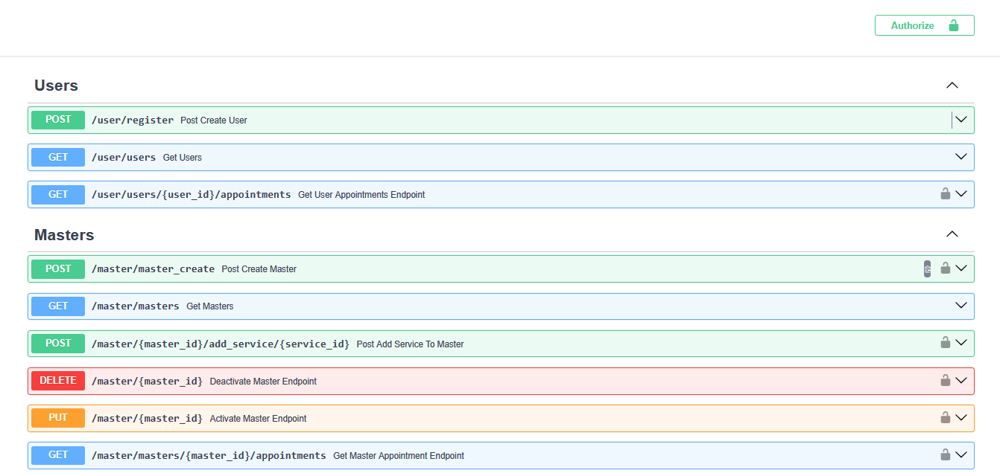
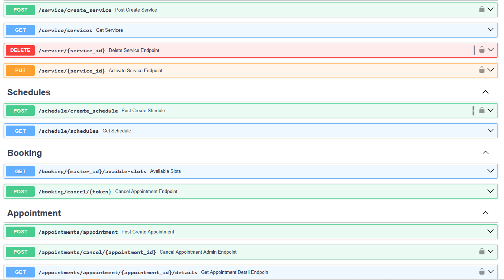
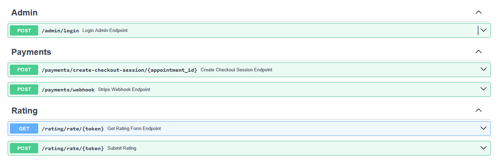
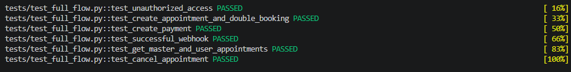

# SmartBooking – Barber Shop Appointment & Online Payment API


---

## Project Overview

SmartBooking is a backend REST API for managing barber shop appointments.

The project goes beyond a traditional CRUD application by focusing on real-world backend problems such as appointment scheduling, preventing double bookings, payment processing, asynchronous task execution, and third-party service integration.

Clients can browse available services, choose a barber, reserve an available appointment slot, complete an online payment using Stripe, while administrators receive automatic Telegram notifications about important booking events.

---

# Motivation

After completing several REST API projects focused primarily on CRUD operations, I wanted to challenge myself with a project where the main complexity comes from business logic rather than database operations.

The goal was to design a booking system similar to those used by real barber shops while solving practical backend problems including:

- appointment scheduling;
- preventing overlapping appointments;
- temporary slot reservation;
- secure online payment processing;
- asynchronous background tasks;
- third-party API integration;
- scalable project architecture.

This became my largest backend project and significantly improved my understanding of designing production-oriented backend applications.

---

# Features

## Appointment Management

- Create appointments
- Dynamic slot calculation
- Variable service durations
- Appointment cancellation
- Double booking prevention
- Temporary slot reservation

## Payment Processing

- Stripe Checkout integration
- Stripe Webhook verification
- Pending payment workflow
- Automatic reservation expiration
- Refund support
- Stored Stripe transaction identifiers

## Background Tasks

- Celery workers
- Redis message broker
- Delayed task execution
- Automatic reservation expiration
- Telegram notifications

## Authentication & Authorization

- JWT Authentication
- bcrypt password hashing
- Administrator-only endpoints

## Infrastructure

- Docker
- Docker Compose
- Alembic migrations
- Automated testing with Pytest

---

# Business Challenges

## Intelligent Appointment Scheduling

The application calculates available appointments using fixed 30-minute time slots.

Instead of validating only the requested start time, the backend calculates how many consecutive slots are required based on the selected service duration.

An appointment can only be created if the entire interval remains available, preventing overlapping bookings while supporting services of different lengths.

---

## Double Booking Prevention

One of the biggest challenges was preventing multiple customers from paying for the same appointment simultaneously.

When a customer starts the payment process:

- the selected slot is immediately reserved for **10 minutes**;
- the appointment receives the **Pending Payment** status;
- a Celery task is scheduled to automatically release the reservation if payment is not completed.

If payment succeeds:

- the scheduled task is revoked;
- the appointment becomes **Confirmed**.

If payment expires or is cancelled:

- the reservation is released automatically;
- the appointment status changes accordingly;
- the slot becomes available again.

This mechanism guarantees that only one customer can successfully reserve a specific appointment time.

---

## Secure Payment Workflow

Payments are processed using Stripe Checkout.

The backend never trusts the client after payment completion.

Appointments become confirmed only after Stripe sends an official webhook confirming that the payment was successful.

This approach guarantees data consistency even if the customer closes the browser before returning to the application.

---

## Post-Appointment Rating System

Implemented a post-appointment rating workflow that schedules feedback requests automatically after completed services while ensuring one-time submissions and reliable rating aggregation.

**Timing.** A Celery task is scheduled at appointment creation time using `eta`, calculated as `start_datetime + service duration`, so the rating request fires exactly when the appointment ends — not on a polling cron job.

**Data integrity.** Ratings are split across two tables instead of one:

- `rating_requests` — a temporary, single-use invitation (token, expiration, used flag) created by the background task.
- `ratings` — only real, submitted scores.

Keeping them separate means the `ratings` table never contains "pending" or unused rows, so aggregate queries (`AVG`, `COUNT`) are always accurate without needing to filter out placeholder data.

**Abuse prevention.** The rating link uses an unguessable, single-use, time-limited token rather than a predictable appointment ID, and a unique constraint on `appointment_id` guarantees at most one rating per visit at the database level — not just in application logic.

On each new rating, the barber's average score is recalculated directly from the `ratings` table (`AVG`/`COUNT`) rather than updated incrementally, avoiding floating-point drift over time.

---

## Background Processing

Time-dependent operations are executed asynchronously using Celery and Redis.

Background workers are responsible for:

- reservation expiration;
- payment timeout handling;
- Telegram notifications.

Keeping these operations outside HTTP requests improves responsiveness and scalability.

---

## Service Layer Architecture

The project separates application responsibilities into dedicated layers.

```
HTTP Request

↓

Router

↓

Service Layer

↓

Data Access Layer

↓

PostgreSQL
```

- **Routers** validate requests and return HTTP responses.
- **Services** contain business logic.
- **CRUD modules** interact directly with the database.

This separation makes the codebase easier to understand, extend, and test.

---

# Technology Stack

### Backend

- Python 3.11
- FastAPI

### Database

- PostgreSQL
- SQLAlchemy
- Alembic

### Authentication

- JWT
- bcrypt
- python-jose

### Payments

- Stripe Checkout
- Stripe Webhooks

### Background Processing

- Celery
- Redis

### Notifications

- Telegram Bot API

### Testing

- Pytest

### Infrastructure

- Docker
- Docker Compose

---

# Project Structure

```text
backend/

├── app/
│   ├── api/          # API endpoints
│   ├── core/         # Security & configuration
│   ├── crud/         # Database access layer
│   ├── db/           # Database session
│   ├── models/       # SQLAlchemy models
│   ├── schemas/      # Pydantic schemas
│   ├── services/     # Business logic
│   └── main.py
│
├── migrations/       # Alembic migrations
│
├── tests/            # Automated tests
│
├── Dockerfile
├── docker-compose.yml
└── requirements.txt
```

---

# API Preview

## Authentication

*(Swagger Screenshot)*



---

## Booking

*(Swagger Screenshot)*



---

## Payments

*(Swagger Screenshot)*



---

## Testing

The project includes automated tests covering the main business logic.

Current test suite:



All tests pass successfully.

# Environment Variables

Create a `.env` file inside the backend directory.

| Variable | Description |
|-----------|-------------|
| DATABASE_URL | PostgreSQL connection string |
| SECRET_KEY | JWT signing key |
| ACCESS_TOKEN_EXPIRE_MINUTES | JWT token lifetime |
| STRIPE_SECRET_KEY | Stripe secret key |
| STRIPE_WEBHOOK_SECRET | Stripe webhook secret |
| TELEGRAM_BOT_TOKEN | Telegram bot token |
| REDIS_URL | Redis connection |
| ADMIN_CHAT_ID | Telegram administrator chat ID |

---

# Running the Project

Clone the repository.

```bash
git clone https://github.com/Ophion666/SmartBooking-Appointment-and-Payments.git
```

Start the application.

```bash
docker compose up --build
```

The application will automatically:

- create all containers;
- start PostgreSQL;
- start Redis;
- launch the Celery worker;
- apply Alembic migrations;
- start the FastAPI server.

Swagger UI is available at:

```
http://localhost:8000/docs
```

---

# Running Tests

Run all tests.

```bash
pytest
```

---

# Future Improvements

Although the application is fully functional, there are several features that could be added in the future:

- customer reminder notifications;
- appointment rescheduling;
- multiple barber shop branches;
- analytics dashboard;
- Redis response caching;

---

# Technical Experience

This project gave me practical experience with:

- designing business logic;
- building layered backend architecture;
- asynchronous programming with Celery;
- Redis message brokers;
- Stripe payment integration;
- webhook processing;
- Telegram Bot API integration;
- automated testing using Pytest;
- Docker containerization;
- designing backend systems that solve real business problems rather than simple CRUD operations.
